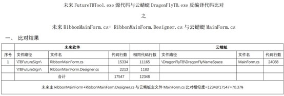
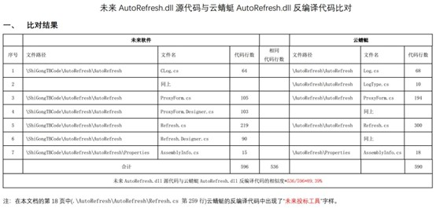
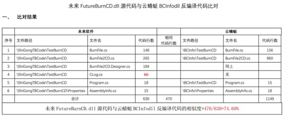
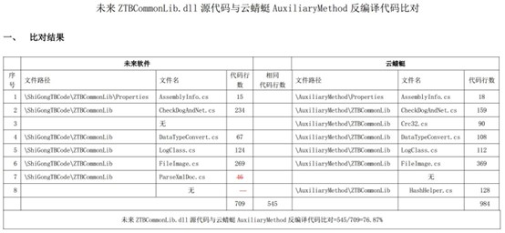
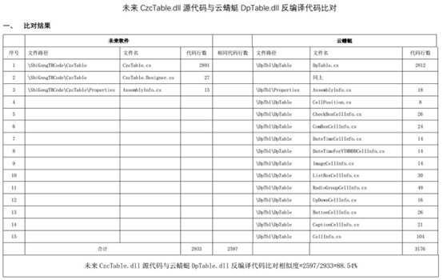
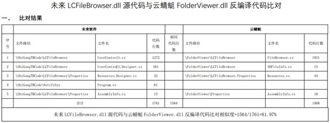
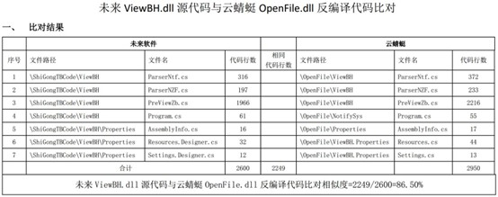
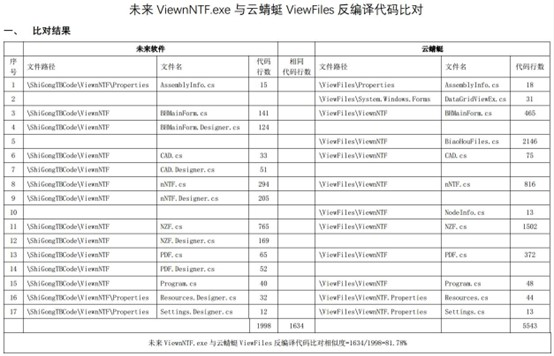

江苏省南京市中级人民法院-民事判决书 
（2018）苏01民初2523号 
原告：南京未来高新技术有限公司，住所地江苏省南京市秦淮区中山南路**号**室。 
法定代表人：匡良，该公司总经理。 
委托诉讼代理人：王欢庆，男，1980年11月23日生，居民身份证号码******************，该公司员工，住江苏省南京市。 
委托诉讼代理人：单文峰，北京大成（南京）律师事务所律师。 
被告：江苏云蜻蜓信息科技有限公司（原南京云蜻蜓信息科技有限公司），住所地江苏省南京市建邺区江东中路211号凤凰和熙文化广场**幢**栋**室。 
法定代表人：刘轶，该公司总经理。 
被告：刘跃波，男，1987年11月8日生，居民身份证号码3426*****************，住江苏省南京市。 
两被告共同委托诉讼代理人：杨照飞，南京知识律师事务所律师。 
两被告共同委托诉讼代理人：袁媛，南京知识律师事务所律师。 
原告南京未来高新技术有限公司（以下简称未来公司）与被告江苏云蜻蜓信息科技有限公司（以下简称云蜻蜓公司）、刘跃波侵害计算机软件著作权纠纷一案，本院于2018年10月15日立案后，依法组成合议庭，并指派技术调查官张耀超辅助案件技术事实查明。本院组织当事人进行了多次证据交换，并于2020年1月13日公开开庭进行了审理。原告未来公司的委托诉讼代理人王欢庆、单文峰，两被告的共同委托诉讼代理人杨照飞到庭参加诉讼。本案现已审理终结。 
原告未来公司向本院提出诉讼请求：1.判令确认“未来网上投标文件制作工具软件”的计算机软件著作权归原告所有；2.判令被告云蜻蜓公司、刘跃波立即停止侵害原告“未来网上投标文件制作工具软件”计算机软件著作权的所有行为；3.判令两被告连带赔偿原告经济损失3855000元；4.判令两被告连带承担本案诉讼费用、保全费用及其他合理费用。审理中，原告未来公司撤回了第1项诉讼请求，并将第4项诉讼请求明确为：判令两被告连带赔偿原告维权支出的合理费用103500元（包括律师费90000元、公证费13500元）并承担本案的诉讼费用、保全费用。事实与理由：“未来网上投标文件制作工具软件”系原告自主开发的软件，于2014年7月4日完成计算机软件著作权登记并取得登记证书。原告于2015年4月1日与南京市公共资源交易中心签署协议，约定将上述软件置于其官方网站供下载使用，每次下载使用的费用为人民币100元整。2017年4月，原告在南京市公共资源交易中心网站发现被告云蜻蜓公司发布的“云蜻蜓软件-投标文件制作工具”软件在程序功能及实现上与原告软件存在高度相似，经对比，上述被告软件中的程序内部函数与原告完全一致，且部分函数中尚留有“未来投标工具”、“南京未来高新技术有限公司”、“futuresoft”等原告的标识，另被告刘跃波原系原告研发部软件工程师，曾参与未来软件投标文件制作工具的研发和后期维护，其于2016年5月从原告处离职，后至被告云蜻蜓公司就职。截至原告提起诉讼前的证据保全日，涉案软件已累计被下载使用38550次。原告认为，两被告在明知原告对案涉计算机软件享有合法著作权的情形下，未经原告允许在南京市公共资源交易中心提供下载进行交易的行为严重侵犯了原告的合法权利，应对其行为承担连带侵权责任。为维护原告合法权益，恳请法院依法裁判。 
被告云蜻蜓公司辩称：被告云蜻蜓公司未实施侵权行为，原告未来公司本案诉讼没有事实和法律依据：1.原告主张的涉案软件是行业通用软件，不具有独创性。被告云蜻蜓公司未实施侵害原告著作权的行为。被告云蜻蜓公司的涉案软件系自行开发，与原告所主张的著作权软件并不相同。原告未来公司指控被告涉案软件与其享有著作权的软件存在高度相似，但实际上二者并不构成相同。该类软件早已是行业通用软件，仅南京市公共资源交易平台就有包括筑龙、益得、未来、云蜻蜓等多家招投标软件工具，其软件功能和程序也都是按照南京公共资源交易中心的要求进行编写，功能和程序虽然存在相似之处，但是并不相同。2.因软件产品的更新换代，被告云蜻蜓公司早已重新组织人员对涉案软件进行重新开发，早已将原被诉侵权软件下架删除，新版软件与原版软件完全不同。原告停止侵权、删除被诉侵权软件的诉请，没有任何事实法律依据。3.根据南京市公共资源交易中心网站显示，原告的涉案软件也一直在更新换代，在云蜻蜓公司涉案软件上线前，原告主张著作权的软件已经不再使用。故无论云蜻蜓公司侵权与否，均不可能对原告造成任何经济损失。4.被告云蜻蜓公司不知晓原告涉案软件的相关信息，被告刘跃波也并非是从原告处离职至被告云蜻蜓公司工作。而是从朗坤智慧科技股份有限公司跳槽至被告云蜻蜓公司。被告云蜻蜓公司并不知晓原告与刘跃波之间的关系以及被告刘跃波的工作内容。被告云蜻蜓公司员工入职时也都进行了入职审查，明确要求不得实施侵害员工入职前所在公司的知识产权行为。被告云蜻蜓公司通过公司制度进行了约束，已经尽到合理的审查义务，即使被告刘跃波曾就职于原告公司，被告云蜻蜓公司也不存在任何原告所指控的侵权行为。 
被告刘跃波辩称：1.被告刘跃波从原告公司离职后，相关工作和资料均已按其要求进行了交接。刘跃波从原告处离职后进入朗坤智慧科技股份有限公司就职，并非如原告所称的从原告处离职后就进入被告云蜻蜓公司就职。虽然后来被告刘跃波确实进入云蜻蜓公司，但实际上并未参与涉案被诉侵权软件的研发工作，进入公司时该软件已基本开发完成。因此被告刘跃波不存在原告所称的侵权行为。2.原告所主张的涉案软件早已是行业内通用软件，原告所主张的软件程序也不具有独创性。3.被告云蜻蜓公司对被告刘跃波之前在原告处就职并不知晓。
双方当事人围绕诉讼请求和抗辩主张提交了证据，本院组织双方当事人进行了证据交换和质证。对当事人对其真实性无异议的证据，本院对其真实性予以认定。 
本院经审理查明： 
一、原告及其涉案软件的相关情况 
原告未来公司成立于1996年7月，注册资本600万元，经营范围为计算机软件开发、技术转让、技术服务等。国内顶级域名管理机构CNNIC授权新网Xinnet.com制作并颁发的《中国国家顶级域名注册证书》显示：域名“futuresoft.com.cn”的注册所有人为原告未来公司，注册时间为2000年3月21日。 
2014年7月4日，原告未来公司取得软件名称为“未来网上投标文件制作工具软件（简称：未来投标工具软件）V1.0”、登记号为2014SR09xxxx的计算机软件著作权登记证书。该证书记载，该软件开发完成日期为2013年12月12日，首次发表日期为2014年4月2日。 
原告未来公司在申请该计算机软件著作权登记时，提交了计算机软件著作权登记申请表、软件文档以及前后各30页的软件源代码等资料。该软件的著作权登记申请表记载，涉案软件使用的编程语言为VisualStudio2010C#。主要功能为：未来投标工具软件是未来公司参照南京市建设工程交易中心工具软件相关规范，为南京市建设工程交易中心交易平台量身定做的专用工具软件。技术特点为：采用先进的Microsoft.NET进行开发采用XML技术存储数据。数据存储灵活，查看便捷。内置独有的AutoCAD读取和显示技术，快速查看、测览各种版本DWG文件而不需要安装Autodesk公司的AUTOCAD软件。内置未来清单软件的招投标文件快速处理引擎，无论生成PDF文档还是标书文件，都有非常明显的速度优势。 
通过原告提交的版本管理软件TortoiseSVN记载的相关信息可以看出原告对该软件进行了更新和维护。例如：2014年3月5日，“Revision”序号为“22”，对应“Author”为“liuyb”，对应“Message”为“上传监理/施工招投标代码”；2015年3月18日，“Revision”序号为“442”，对应“Author”为“liuyb”，对应“Message”为“…2、2015-3-1交易中心启用新的网址，点击软件中[投标文件上传]功能新链接为：http://ggzy.njzwfw.gov.cn/njhy/login_07.aspx...”；2015年12月3日，“Revision”序号为“569”，对应“Author”为“zhuym”，对应“Message”为“修改投标保证金必须导入确认函等扫描件”等。从2014年3月至2017年11月，TortoiseSVN软件记载的未来公司对相关软件修订的次数达600余次。 
2019年1月10日，原告将本地计算机连接至Internet地址为“221.226.177.10”、目标地址为“VPN连接”的网络，使用TortoiseSVN软件的“checkout”功能，导出“URLofrepository”地址为“svn://192.168.100.2/FTBT_NEW/trunk/code/施工招投标工具代码/ShiGongTBCode”中“Revision”序号为“22”中的源代码。该公证书导出的TortoiseSVN日志显示，自2014年3月至2018年8月，未来公司对相关软件修订的次数达700余次。上述证据保全经南京市石城公证处公证并出具了（2019）宁石证经内字第278号公证书。 
原告在本案中主张著作权的即上述使用TortoiseSVN软件导出的“Revision”序号为“22”，2014年3月5日上传的未来网上投标文件制作工具软件的源代码（以下简称未来SVN源代码）。原告陈述：该软件的源代码一共有11万多行。其在本案中主张著作权的是原告自行撰写的部分，源代码行数有78000多行，其中包括6个dll文件，2个exe文件、全部主程序。剩下的部分来自第三方，原告不主张著作权。 
原告将未来SVN源代码中“\ShiGongTBCode\TBFutureSign\”目录下的RibbonMainForm.cs文件和前后各30页的备案登记的源代码进行了逐行比对，并出具比对报告。原告认为两者的相似度在99.9%以上。对此，两被告认为备案登记的源代码中没有注释部分，两者明显不同。两被告还认为，TortoiseSVN软件内容和时间均可以进行人为的修改，故原告提交的未来SVN源代码不具有客观真实性。原告提交的涉案软件备案登记的查询资料只有前两页有备案登记机构的档案查询专用章，并没有加盖骑缝章，故原告提交的备案登记的源代码的真实性也无法确认。 
本案审理过程中，原告编译未来SVN源代码，生成目标程序，对运行目标程序的过程进行录像，并当庭演示，当庭演示结果与录像情况相同。将上述目标程序的运行结果与版权局备案的软件界面比对，两者的初始界面、软件整体界面、功能按钮的布局、功能按钮基本相同。 
二、两被告的相关情况 
被告云蜻蜓公司成立于2017年1月，原注册资本131万，现变更为5000万。2019年12月其名称由“南京云蜻蜓信息科技有限公司”变更为现名。 
2016年4月29日，被告刘跃波向原告未来公司提交离职申请书，该申请书记载被告刘跃波于2012年6月入职原告未来公司。原告提供的交接人为朱艳梅的离职交接清单中记载，刘跃波接收了南京施工投标工具、南京政府购买服务投标工具、南京监理投标工具等项目的代码及相关文档材料并签字确认。 
被告刘跃波陈述，其2016年5月从原告处离职后，进入朗坤智慧科技股份有限公司就职，后于2017年2月底才入职云蜻蜓公司。 
三、被诉侵权软件及侵权比对的相关情况 
（一）被诉侵权软件的相关情况 
2017年7月4日，原告的委托代理人进入南京市公共资源交易中心网站http://ggzy.njzwfw.gov.cn，下载名为“云蜻蜓软件-投标文件制作工具1.0.0.92017-6-30”的投标软件安装文件，该证据保全经南京市石城公证处公证并出具（2017）宁石证经内字第5337号公证书。 
2017年10月9日，被告云蜻蜓公司的委托代理人进入南京市公共资源交易中心网站http://ggzy.njzwfw.gov.cn，下载名为“云蜻蜓新版工程投标工具v1.0.0”的投标软件安装文件，并进入“e路阳光”南京市建设工程网上交易平台网站。相关网页显示：该软件上传的时间是2017年10月8日；查询云蜻蜓投标软件截止至2017年7月10日和2017年10月8日的下载使用记录分别为2162次和10054次。该证据保全经南京市石城公证处公证并出具（2017）宁钟证经内字第7241号公证书。 
2018年5月29日，原告的委托代理人再次进入南京市公共资源交易中心网站http://ggzy.njzwfw.gov.cn，下载名为“云蜻蜓新版工程投标工具V2.0.0.05”的投标软件安装文件，并进入“e路阳光”南京市建设工程网上交易平台网站，查询云蜻蜓投标软件总计被下载使用记录38550次，该证据保全经南京市石城公证处公证并出具（2018）宁石证经内字第4676号公证书。 
原告陈述，其2017年7月4日公证下载的云蜻蜓投标文件制作工具软件安装文件（以下简称云蜻蜓安装文件）可以反编译得到相应的源代码，2018年5月29日公证的被控侵权软件被告云蜻蜓公司进行了加密，无法进行反编译。故原告以2017年7月4日公证的云蜻蜓安装文件作为侵权比对对象。 
被告云蜻蜓公司陈述，被控侵权软件于2017年4月才上传，2017年10月8日其已将软件改版为云蜻蜓新版工程投标工具软件，与2017年7月4日原告保全的软件完全不同。本案审理过程中，被告云蜻蜓公司一直未提交其所称的改版后软件的源代码以证明其上述主张。直至2020年12月21日，被告云蜻蜓公司才提交情况说明称其愿意提交改版后的软件源代码作为本案证据。 
（二）源代码比对的情况 
1.原告选取源代码的8个部分进行人工比对的情况 
原告在其提交的未来SVN源代码中，去除掉部分配置文件、模板文件、公共文件和图片文件后，选取主程序FutureTBTool.exe、六个DLL文件以及ViewnNTF.exe文件等8个部分（见下表）与云蜻蜓安装文件反编译后对应的源代码进行比对。 
| 序号 | 原告比对对象 | 被告比对对象 |
|:---|:---|:---|
| 1 | FutureTBTool.exe源代码 | DragonFlyTB.exe反编译代码 |
| 2 | AutoRefresh.dll源代码 | AutoRefresh.dll反编译代码 |
| 3 | FutureBurnCD.dll源代码 | BCInfo.dll反编译代码 |
| 4 | ZTBCommonLib.dll源代码 | AuxiliaryMethod.dll反编译代码 |
| 5 | CzcTable.dll源代码 | DpTbl.dll反编译代码 |
| 6 | LCFileBrowser.dll源代码 | FolderViewer.dll反编译代码 |
| 7 | ViewBH.dll源代码 | OpenFile.dll反编译代码 |
| 8 | ViewnNTF.exe源代码 | ViewFiles反编译代码 |

具体的比对方法是通过反编译软件ILSpy对云蜻蜓安装文件进行反编译，获得反编译的源代码后，与原告提交的未来SVN源代码中的核心功能文件进行逐行比对，其中代码是否构成实质性相同通过人工识别，例如业务逻辑、功能相似，仅更换语法，即被人工识别为相似代码行。统计出构成相似的代码行数除以原告代码总行数，计算出相似度。上述8个部分的代码对比结果见附图1的8个表格。 
通过上述比对，原告认为在其主张著作权的78000多行源代码中，其已经手工对比了其中的26708行，其中相同的行数是20760行，总体相似度是77.73%。 
两被告不认可原告的上述比对结果，认为：（1）原告反编译后的代码，被告无法确认，其与被告反编译后的代码存在明显差别，两者的大小存在明显差异；（2）原告用于比对的未来SVN源代码是从原告SVN服务器下载的软件代码，但该代码可以进行修改，故未来SVN源代码不应作为比对对象；（3）通过人工比对的方式不客观真实，内容相似度的判断依据为原告自行认定，且原告与被告的比对结果存在明显差异；（4）使用反编译进行代码比对的方式有着极大的局限性和误差，不能准确反映所比对软件代码的真实差异；（5）原告仅筛选部分反编译文件及代码，无法反应涉案软件的整体相似度。 
2.原告利用相关工具软件进行比对的情况 
原告按照如下步骤使用二进制对比软件BinDiff进行了源代码比对：（1）通过VisualStudio编译未来SVN源代码、安装云蜻蜓安装文件，分别获得对应的程序文件，包括原告未来投标工具软件中的FutureTBTool.exe、AutoRefresh.dll、BurnCD.dll、FutureBurnCD.dll、GetMacCPUHD.dll、ViewBH.dll、LCFileBrowser.dll、ViewnNTF.exe、ZTBCommonLib.dll、网上招投标符合检查(工具).dll和CzcTable.dll等11个文件，以及被告云蜻蜓投标工具软件中的DragonFlyTB.exe、AutoRefresh.dll、mscd.dll、BCInfo.dll、Address.dll、OpenFile.dll、FolderViewer.dll、ViewFiles.exe、AuxiliaryMethod.dll、ztbchk.dll、DpTbl.dll等11个文件；（2）通过反汇编软件IDAPro分别加载上述文件，获得相应后缀名为idb的文件；（3）使用二进制对比软件BinDiff比对分析idb文件，得到11个文件的对比结果见附图2的表格。 
3.两被告利用比对软件进行比对的情况 
两被告将云蜻蜓安装文件反编译后获得的130个文件（其中50个文件能够在未来SVN源代码中找到同名文件），通过比对软件BeyondCompare与未来SVN源代码进行逐行比对（未使用人工比对方式），其认为二者相似度极低，基本上都未超过10%。原告认为，完全使用比对软件的比对方式存在极大误差，在BeyondCompare里面判断一行是否存在重大差异的标准是是否有一个字符不同，但是判断代码是否相同应当除了基本的代码相同外，还应当考虑代码的逻辑、变量命名、实现的功能进行整体考虑。 
庭审中，本院组织双方使用BeyondCompare比对软件，抽取部分未来SVN源代码、云蜻蜓安装文件反编译后的源代码进行比较，发现部分被该软件判断为不同的代码行中，主要的差别仅为变量名称不同。而上述名称不同的变量实际上并不影响代码行的逻辑功能，两者实质性相同。例如，两个软件对应的代码行中分别出现变量X和变量this.X，BeyondCompare比对软件判断的结果为代码不同，但两者实际逻辑功能一致。 
4.关键词比对情况 
原告通过反编译软件ILSpy和JetBrainsdotpeek，对云蜻蜓安装文件安装后的程序文件进行反编译，查看原告公司名称等关键词信息是否均出现在上述两份源代码中。结果如下： 
（1）对AutoRefresh.dll分别使用ILSpy、JetBrainsdotpeek反编译后，在得到的Refresh.cs中均出现了“未来投标工具”字样； 
（2）对主程序DragonFlyTB.exe分别使用ILSpy、JetBrainsdotpeek反编译后，在得到的JingJiBiaoForm.cs、frmCheck.cs、frmThirteenCheck.cs三个文件中均出现了“5360-1027-0143-3004”“1100528”及“南京未来高新技术有限公司”字样，分别代表原告购买第三方商用报表组件的密码、产品号及用户名称，这些信息在原告未来SVN源代码TBFutureSign目录下的Form1.cs、JingJiBiaoForm.cs和frmCheck.cs文件中均有记载。 
（3）对主程序DragonFlyTB.exe分别使用ILSpy、JetBrainsdotpeek反编译后，在得到的MainForm.cs文件中出现了以“FutureSoft”开头、名称为FutureSoftWeb_Click的变量。 
（4）对主程序DragonFlyTB.exe分别使用ILSpy、JetBrainsdotpeek反编译后，在得到的Program.cs文件中出现了如下语句mxDrawApplicationClass.InitMxDrawOcx("南京未来高新技术有限公司"，"FutureSoft"，"025-2349150"，"************************")，其中长串的字符为原告购买第三方控件MxDraw的授权码，这些信息在原告未来SVN源代码TBFutureSign目录下的Program.cs文件以及ViewnNTF目录下的Program.cs文件中均有记载。 
（5）对ViewFiles.exe分别使用ILSpy、JetBrainsdotpeek反编译后，在得到的Program.cs文件中存在与上一项相同的情况。 
5.原告用其登记备案的源代码进行比对的情况 
原告将云蜻蜓安装文件反编译后获得的源代码与原告登记备案的源代码的前三十页和后三十页进行比对人工逐行比对，比对结果是前三十页的相似度是85.38%，后三十页的相似度是69.79%。 
两被告不认可原告的上述比对结果，认为：（1）备案的前后三十页代码仅为软件中的极小部分，软件同一性比对应当综合整体代码进行比对判断；（2）两者的比对并不存在原告所称的相似情况，原告在人工比对中过程中存在大量错误；（3）原告将微软自带公用代码、开发工具标准类库作为其独创性部分进行保护；（4）原告代码中存在大量控件，同类型控件的使用方法相同必然导致代码相同，该部分代码不应列入比对范围。 
（三）软件运行界面比对的情况 
原告分别运行其编译后的未来SVN源代码、云蜻蜓安装文件，对运行后的部分界面进行对比：1.两者主界面整体布局及功能分布相近似；2.两者Cell组件及多项对应的提示信息相同；3.预览招标文件界面整体布局相似。 
两被告认为，两者界面不构成相似，理由为：1.在界面上方菜单栏、各功能模块内容、按钮、设计图标等存在明显的差异；2.原告主张的相似部分是行业同类软件所公用的界面设计，并非原告独创；3.案涉软件所附的相关文本文件均是南京公共资源交易中心提供的模板文件，并非原告设计，不能作为界面的比对对象。 
（四）司法鉴定的相关情况 
2019年3月28日，未来公司提出司法鉴定申请，请求对（2019）宁石证经内字第278号公证书所保全原告未来公司的投标软件源代码与(2017)宁石证经内字第5337号公证书所保全被告云蜻蜓公司的投标软件目标程序是否构成相同或实质性相同进行鉴定。同年10月23日，本院委托上海上信计算机司法鉴定所进行司法鉴定。12月9日，上海上信计算机司法鉴定所向本院发函，请本院要求当事人提供涉案软件源代码。12月23日，两被告同意按照鉴定机构的要求提供与被控侵权软件目标程序一致的源代码。12月26日，两被告主张，因为保密的原因，其提交的被控侵权软件的源代码只能提供给法院和鉴定机构。原告认为，被告提交的源代码是否与被控侵权软件的目标程序相一致无法确定，原告依法需要对该源代码进行质证，为此原告愿意签署保密承诺。两被告坚持认为，不能将源代码作为证据提交给原告质证。因两被告不能提供上海上信计算机司法鉴定所要求的涉案软件源代码，本案司法鉴定程序终止。 
四、本案查明的其他事实 
2015年4月1日，原告未来公司作为乙方与甲方南京市公共资源交易中心签订有效期至2015年12月31日的《南京市建设工程网上招投标平台工具软件使用协议书》。合同约定甲方建立网上招投标平台，提供“南京市建设工程网上招投标e路阳光平台”，按季度提供乙方使用网上招投标平台的使用次数清单。乙方开发施工招投标的配套软件工具，按照使用配套软件工具的次数向使用方收取软件使用费。费用结算条款约定，乙方根据有关文件规定，每次通过中金支付网上支付平台收取成功上传标书的用户软件使用费100元人民币，每季度由甲方通过奖惩考核结算后，从支付平台划转。每季度软件使用次数小于或等于3000次时，乙方将收益总额的30%投入甲方的平台维护建设;每季度软件使用次数大于300次且小于或等于4500次时，乙方将超出3000次部分的收益的40%投入甲方的平台建设:每季度软件使用次数大于4500次时，乙方将超出4500次部分的收益全部投入甲方的平台建设。上述投入甲方平台建设的费用由支付平台直接划转给甲方。 
2016年1月1日、2016年7月1日，原告未来公司作为乙方分别与甲方南京市公共资源交易中心签订两份有效期分别至2016年6月30日、2017年6月30日的《南京市公共资源交易中心软件系统维护合同》。两份合同的“合同款支付”条款均约定，乙方根据有关文件规定，每次通过中金支付网上支付平台收取成功上传标书的用户软件使用费100元人民币，每季度由甲方通过奖惩考核结算后，从支付平台划转。 
2017年4月12日，被告云蜻蜓公司作为乙方与甲方南京市公共资源交易中心签订有效期从2017年4月12日至2017年12月31日的《南京市公共资源交易中心软件系统维护合同》。合同的“合同计价方式”条款约定，本合同项下服务单价以每次通过中金支付网上支付平台收取成功上传标书的用户软件使用费100元人民币为计算基准。“合同款支付”条款约定，本配套软件工具自合同签订起90天内免费使用，免费使用期后90天内半价收取费用，优惠期届满后，恢复正常价格。 
2018年9月7日，原告的委托代理人使用手机进入被告云蜻蜓公司的微信公众号。该公众号中的微信文章“福利不玩虚的，你们要的中秋、国庆双节福利来啦！”推出了“任一全专业未来旧锁免费换两套云蜻蜓超级清单全专业新锁”、“任一未来单专业旧锁免费换云蜻蜓超级清单全专业新锁”两项福利，并以被告云蜻蜓公司的“新锁”和原告未来公司的“旧锁”为配图。该公众号中的另一微信文章“超级清单老锁升级通知”显示，上述活动的客户服务电话为4008898118。上述证据保全经南京市石城公证处公证并出具（2018）宁石证经内字第7079号公证书。同日，原告拨打上述公证书中的客户服务电话4008898118，原告问：你们和南京未来高新技术有限公司现在是一家么，是更新换代改名字了么？对方回答：以前是一家，现在分拆分成两家。上述证据保全经南京市石城公证处公证并出具（2018）宁石证经内字第7080号公证书。 
原告未来公司主张其为本案支付公证费13500元，律师费9万元，并提交了相应的票据。 
被告云蜻蜓公司提交了其于2017年3月1日与成都梦想凯德科技有限公司签订的“《梦想绘图控件5.2浏览版》技术服务合同”，用以证明其为开发云蜻蜓招投标工具购买了正版组件。 
本案争议焦点是：一、原告是否有权就涉案软件主张著作权；二、两被告是否侵犯了原告对涉案软件享有的著作权；三、两被告是否应承担相应的民事责任。 
本院认为： 
一、原告有权就涉案软件主张著作权 
两被告抗辩认为，因TortoiseSVN软件记载的内容和时间均可以进行人为修改，故原告提交的未来SVN源代码不具有客观真实性。同时，原告提交的涉案软件备案登记的查询资料只有前两页有备案登记机构的档案查询专用章，故其提交的备案登记的源代码的真实性也无法确认。因此，原告无权就涉案软件主张著作权。本院认为，原告提交的证据能够互相印证，足以证明其有权就涉案软件主张著作权，理由如下： 
第一，《最人民法院关于审理著作权民事纠纷案件适用法律若干问题的解释》第七条规定，当事人提供的涉及著作权的底稿、原件、合法出版物、著作权登记证书、认证机构出具的证明、取得权利的合同等，可以作为证据。在作品或者制品上署名的自然人、法人或者其他组织视为著作权、与著作权有关权益的权利人，但有相反证明的除外。本案中，原告提交的国家版权局于2014年7月4日出具的“未来网上投标文件制作工具软件”的著作权登记证书，在两被告没有提供相反证据的情况下，可以证明原告对涉案软件享有著作权。 
第二，虽然SVN服务器上的内容及时间均可以进行人为修改，但是原告主张权利的未来SVN源代码的上传日期为2014年3月5日，属于早期版本，其后直至2018年8月，TortoiseSVN软件记录的修订记录达700余次，上述修订记录具有合理的顺延性。 
第三，经比对，未来SVN源代码与原告提交的备案登记的源代码除少量注释不同外，两者基本相同。同时，未来SVN源代码能够编译运行，生成的目标程序的运行界面与备案登记的软件运行界面基本相同。 
第四，未来SVN源代码上传时间为2014年3月5日，上传账户名为liuyb，该账户名应为被告刘跃波的姓名拼音缩写，与刘跃波在原告处的工作时间和内容均能相互印证。 
二、两被告侵犯了原告对涉案软件享有的著作权 
著作权侵权案件中判断被诉侵权作品是否使用了享有著作权作品的方法一般适用“接触加实质性相似”的原则。关于接触可能性，首先，在案证据显示被告刘跃波自2012年6月至2016年4月间在原告处任职，并接收了原告的南京施工投标工具、南京政府购买服务投标工具、南京监理投标工具等项目的代码及相关文档材料。其次，TortoiseSVN软件记载的原告对涉案软件的修订记录中，多次出现应为被告刘跃波姓名拼音缩写的账户名liuyb。最后，被告云蜻蜓公司成立于2017年1月，刘跃波于同年2月底入职云蜻蜓公司，被控侵权软件于2017年4月上传南京市公共资源交易中心。从上述时间节点来看，不能排除被告云蜻蜓公司从刘跃波处获得原告主张权利的涉案软件的可能性。故综合上述事实，本院认为，被告云蜻蜓公司具有接触到原告主张权利的涉案软件的可能性。 
关于实质性相似。首先，计算机软件著作权侵权判定的一般原则是将被诉侵权软件源代码与享有著作权的软件源代码进行比对。本案中，虽然原告通过对被控侵权的目标程序进行反编译后得到的源代码进行手工比对的方法误差较大，且原告仅对其主张权利的7万多行源代码中的2万多行进行了比对。但根据源代码的比对结果及技术分析可知，比对的大部分程序文件在程序逻辑和结构方面实质相同，函数变量命名特点相同或相似，比对的源代码大部分也相同。其次，云蜻蜓安装文件反编译后，在得到的文件中出现了“南京未来高新技术有限公司”、“未来投标工具”、“FutureSoft”等包含原告公司信息的字样，甚至还出现了原告购买第三方商用报表组件密码、产品号、用户名称和原告购买第三方控件的授权码等非公开信息。上述现象难谓巧合，两被告对此也未做出合理解释。再次，云蜻蜓安装文件反编译后，得到的文件中存在较多的文件名称与原告主张权利的涉案软件的文件名相同的情况，且两软件运行后的主界面整体布局及功能分布也相近似。最后，在原告已经提供了未来SVN源代码的情况下，被告云蜻蜓公司在本案审理过程中始终不愿将被诉侵权的云蜻蜓安装文件的源代码作为证据提交，理应承担举证不能的不利后果。因此，本院认为，根据现有证据可以认定被控侵权的云蜻蜓安装文件与原告主张权利的涉案软件实质性相似的比例较高。 
综上，被告云蜻蜓公司未经原告许可，擅自复制并对公众提供下载被控侵权软件的行为，侵犯了原告对涉案软件享有的著作权。另外，如前所述，现有证据已经形成证据链，足以证明被告云蜻蜓公司的被控侵权软件来自于被告刘跃波。被告刘跃波未经原告许可复制涉案软件的行为，亦侵犯了原告对涉案软件享有的著作权。 
三、两被告应承担相应的民事责任 
本案中，两被告侵犯了原告对涉案软件享有的著作权，应承担停止侵权并赔偿损失的民事责任。被告云蜻蜓公司辩称其于2017年10月8日已对被控侵权软件进行了改版，但并没有在合理的时间内提供足够的证据予以证明，本院对此不予支持，其仍需承担停止侵权的民事责任。
关于赔偿数额的确定。原告主张，截至原告公证保全的2018年5月29日，被控侵权软件已累计被下载使用38550次，而原告的涉案软件每次下载使用的费用为100元，故原告因两被告的侵权行为造成的经济损失为3855000元。本院认为，根据《中华人民共和国著作权法》第四十九条之规定，侵犯著作权或者与著作权有关的权利的，侵权人应当按照权利人的实际损失给予赔偿；实际损失难以计算的，可以按照侵权人的违法所得给予赔偿。赔偿数额还应当包括权利人为制止侵权行为所支付的合理开支。权利人的实际损失或者侵权人的违法所得不能确定的，由人民法院根据侵权行为的情节，判决给予五十万元以下的赔偿。本案中，原告有权按照其实际损失要求赔偿。具体的计算方法需考虑以下因素：1.原告提交的3份与南京市公共资源交易中心签订的合同中关于其实际获得收益的约定存在不一致的情形。对于涉案软件每次100元的下载使用费到底需不需要支付一部分给南京市公共资源交易中心用于网上招投标平台的维护建设以及具体的支付比例等问题，原告都没有提供相应的证据予以佐证。故原告提出的每次下载使用的费用为100元的计算依据没有事实依据，本院将综合现有证据对原告实际从涉案软件每次下载使用中获得的受益进行酌定。2.因两被告提出的其早已对被控侵权软件进行了改版的抗辩主张没有事实依据，本院对原告提出的被控侵权软件累计被下载使用次数的计算方法予以采纳。3.原告只主张涉案软件中其自行撰写部分的软件著作权。4.两软件实质性相似的比例。综上，本院确定两被告应赔偿原告的实际损失为130万元。原告还主张其为本案支出公证费13500元，律师费9万元，合计103500元，本院在合理范围内予以酌情支持8万元。 
综上，依照《中华人民共和国著作权法》第二条、第十条、第四十八条第（一）项、第四十九条，《计算机软件保护条例》第五条、第七条、第二十四条、第二十五条，《最高人民法院关于审理著作权民事纠纷案件适用法律若干问题的解释》第七条、第二十六条，《中华人民共和国民事诉讼法》第六十四条第一款之规定，判决如下： 
一、被告江苏云蜻蜓信息科技有限公司、刘跃波于本判决生效之日起立即停止侵害原告南京未来高新技术有限公司“未来网上投标文件制作工具软件”著作权的行为； 
二、被告江苏云蜻蜓信息科技有限公司、刘跃波于本判决生效之日起十日内赔偿原告南京未来高新技术有限公司经济损失130万元； 
三、被告江苏云蜻蜓信息科技有限公司、刘跃波于本判决生效之日起十日内赔偿原告南京未来高新技术有限公司为制止侵权行为所支付的合理费用8万元； 
四、驳回原告南京未来高新技术有限公司的其他诉讼请求。 
如果未按本判决指定的期间履行给付金钱义务，应当按照《中华人民共和国民事诉讼法》第二百五十三条之规定，加倍支付迟延履行期间的债务利息。 
本案案件受理费38468元，由被告江苏云蜻蜓信息科技有限公司、刘跃波负担。 
如不服本判决，可在判决书送达之日起十五日内，向本院递交上诉状，并按对方当事人的人数提出副本，上诉于最高人民法院。同时，根据国务院《诉讼费用交纳办法》的有关规定，向最高人民法院预交上诉案件受理费。 
审判长　　徐新 
审判员　　薛荣 
审判员　　雒强 
二〇二〇年十二月二十八日 
***
附图1 
 
附图2 
 
附图3 
 
附图4 
 
附图5 
 
附图6 
 
附图7 
 
附图8 
 
